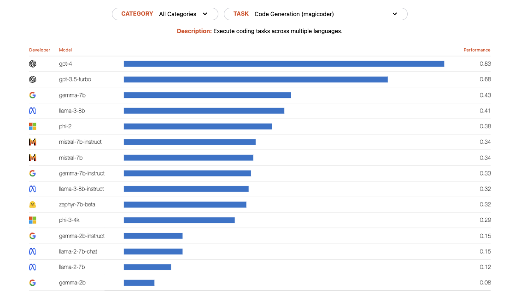

# LetItCode

## Dataset
- Leetcode dataset [(data card)](https://huggingface.co/datasets/RayBernard/leetcode)

2.36K example code

## Code Model Fine Tune

### In-context Learning models
- gpt-4
- Some models

### Finetuning LLM Models
Both have some great fine-tune performance

- gemma-7b [Model Card](https://huggingface.co/google/gemma-7b)
- Llama-3.1-8B-Instruct [Model Card](https://huggingface.co/meta-llama/Llama-3.1-8B-Instruct)

- Phi-3-mini-4k-instruct [Model Card](https://huggingface.co/microsoft/Phi-3-mini-4k-instruct)

source: [Predibase](https://predibase.com/fine-tuning-index)

## Evaluation Methods
### Metrics 
- BLEU (metric used in machine translation for testing n-gram overlap with a known reference)
- CodeBLEU (a mixture of various syntactic and semantic metrics)
- Functional correctness (check how many unit tests pass)

### Benchmarks
- Leetcode problems 
- MBPP 
- Human Eval

### Qauntitative Example Template for Eval
| Models/Metrics | BLEU | CodeBLEU | PassedTestCase |
|----------------|------|----------|----------------|
| LLama-3-8B     |      |          |                |
| Gemma-7B       |      |          |                |

| Difficulties Level / Models | Model 1   | Model 2 | Model 3 |
|-----------------------------|-----------|---------|---------|
| Easy                        | Pass rate |         |         |
| Medium                      |           |         |         |
| Hard                        |           |         |         |

### Qualitative Example Template for Eval
- Python code syntax
- Qaulity of the code
- Problem solving strategies
- etc etc...

## Required Experiements (must have)

- ***Results for in-context learning.*** Compare and contrast the performance of your two in-context learning methods. Which approach worked best overall? Is there evidence that you overfit on the train or validation
set?
-  ***Results for finetuning.*** Compare and contrast the performance of your two finetuning methods. Which approach worked best overall? Is there evidence that you overfit on the train or validation set?
- ***Error analysis***. Discuss the errors made by your four approaches. Did the approaches all make similar errors? Make sure to include some qualitative examples as well as a quantitative analysis.
- ***Best system for deployment.*** Suppose you would like to deploy an AI system for your chosen task at scale. Which of the four approaches would you pick and why?

### Peft
- LoRA:

hyperpaparameters: rank, Lora_alpha, lora_dropout

### In-context Learning
Ref: [prompt engineering guide](https://www.promptingguide.ai/)
#### Few shots (will have to give examples though)
- prompt engineering: CoT

### Zero shots
- prompt engineering: CoT

## Additional Experiements (choose one)

- ***(Finetuning)*** Compare and contrast full model finetuning with two types of parameter efficient finetuning. In your report, justify the performance changes you observe using your knowledge of the different approach.

- ***(In-context)*** Develop an alternative method for your task that employs retrieval augmentation. Describe your method
and show how incorporating it changes performance relative to the 4 “base” configurations from Problem 2.

## Ethical Consideration

Ethical considerations around your choice of task and datasets. Just some consideration about the right use of the model